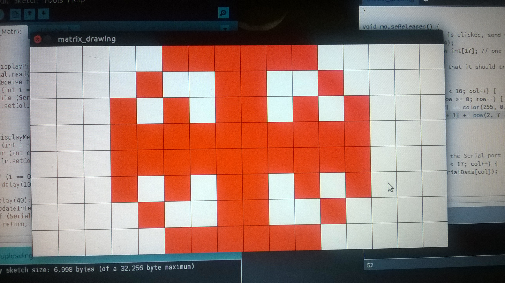
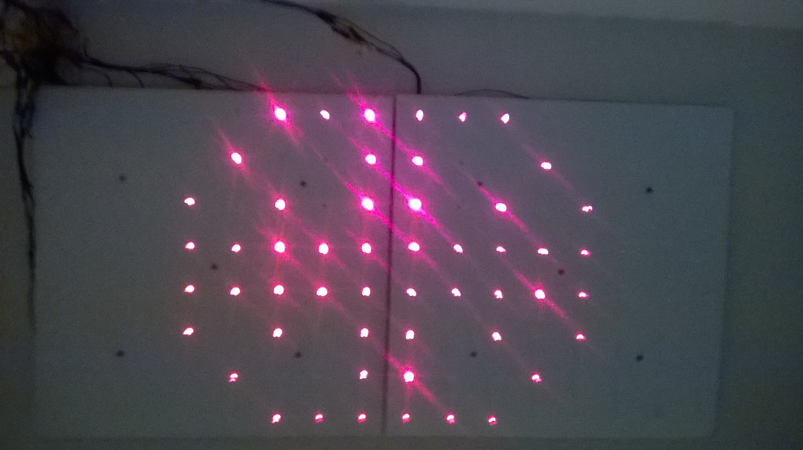

# LED Matrix Control Sketch

## Description

- Provides interface with which to toggle individual LEDs with the [Arduino project](https://github.com/asgaines/LED-Matrix-Arduino)

## Usage

- Install [Processing](https://processing.org/download/)
- Download this package and place in your Processing sketchbook directory
- Open project in Processing (restart application if open when installing)
- Press Play button in Processing window
- Click around! Left click to turn LED on, right click to turn off. Click-and-drag supported.
